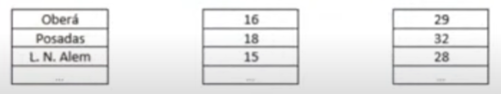

En tres vectores diferentes se guardan los nombres, temperaturas mìnimas y màximas de 5 ciudades de la provincia de misiones. En el primer vector se guardan los nombres de las ciudades, en el segundo las temperaturas minimas alcanzadas y en el tercero las temperaturas maximas alcanzadas en la ultima semana.

Se necesita un programa que permita la carga de las ciudades, sus temperaturas minimas y maximas; ademas, deberà poder informar por pantalla cual fue la ciudad con la temperatura mas baja y cual con la temperatura mas alta (dando a conocer al mismo tiempo la cantidad de grados)

