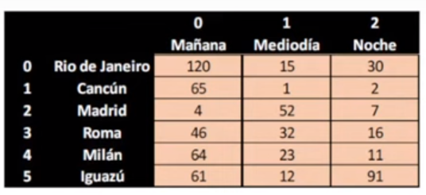

# PROGRAMA PARA CONTROLAR DISPONIBILIDAD DE VUELOS

Una compañia de vuelos cuenta con 6 destinos a los que realiza 3 vuelos diariamente
* uno por la mañana
* uno al medio dia
* uno por la noche

Para administrar estos datos, utiliza una matriz, donde cada fila es un destino y en cada columna se guarda la cantidad de asientos disponibles. Por ejemplo:

1. Se necesita un programa que permita la carga de la matriz con la cantidad de asientos para cada vuelo.

2. Al mismo tiempo, el programa debe permitir a un usuario ingregar el numero de destino al que quiere dirigirse, el numero de vuelo (mañana, mediodia, noche) y la cantidad de pasajes que necesita.

3. A partir de la solicitud del usuario, el programa debe controlar si hay la cantidad suficiente de asientos para la cantidad de pasajes que se requiere.

En caso de que asi sea, se debe mostrar por pantalla que diga "Su reserva fue realizada con éxito", y se debe descontar del total de asientos los solicitados por el usuario. 

En caso no haber asientos disponibles, se debe informar otro cartel que diga "Disculpe, no se pudo completar su operacion, no hay asientos disponibles. 

Desde la compañia de vuelos manifiestan que **NO CONOCEN** cuantas ventas / reservas se hacen por día. Por lo cual, para finalizar las ventas se ingresa la palabra "finish".